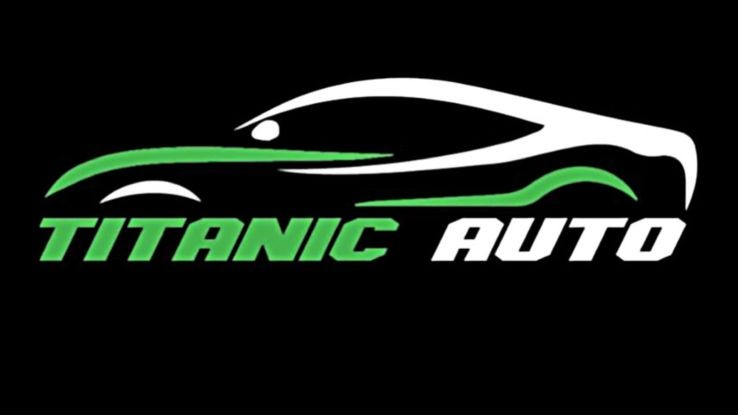

# Titanic - Création du application web de Gestion de Véhicules

## Description
**Titanic** est une application web de gestion de véhicules (voitures et motos) permettant aux utilisateurs de consulter un catalogue de véhicules, d'en acheter, de vendre ou d'échanger, et de bénéficier d'offres spéciales en fonction de leur statut de connexion. Les administrateurs disposent d'un tableau de bord pour gérer les offres, les véhicules et les utilisateurs.

## Fonctionnalités

### Utilisateurs
- **Connectés** :
  - Consulter et acheter des véhicules avec une réduction de 2 %.
  - Accéder aux informations du site, y compris les vidéos et les contacts.
  - Visualiser le catalogue complet des voitures et motos disponibles.
  - Ajouter des véhicules à leur liste (achat, vente, échange).
  - Rechercher des véhicules spécifiques à l'aide d'un formulaire.

- **Non connectés** :
  - Consulter la page d'accueil avec les véhicules disponibles.
  - Visualiser les véhicules sans pouvoir les acheter.

### Administrateur
- Connexion, mise à jour, ajout et suppression de véhicules et d'utilisateurs.
- Ajout et gestion d'offres spéciales pour les utilisateurs.
- Contrôle de la disponibilité des véhicules dans la base de données.

## Structure du projet

- **css/** : Fichiers CSS pour le style de l'interface.
- **db/** : Fichiers de base de données.
- **image/** : Images utilisées dans l'application.
- **photosCars/** : Photos spécifiques des véhicules disponibles.
- **php/** : Scripts PHP pour la gestion de la connexion et des fonctionnalités de l'application.
